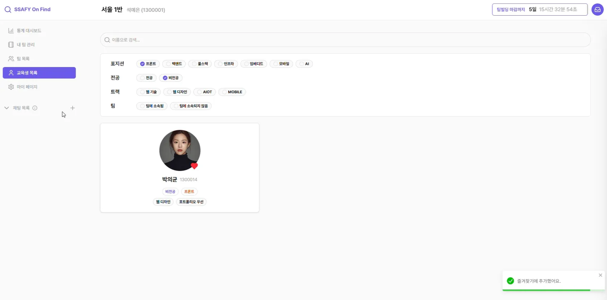

# 시연 시나리오

태그: 디자인

# 1. 대시보드 화면

1. 교육생 목록 : 사이드바에서 교육생 목록을 클릭하여 교육생 목록 페이지로 갈 수 있습니다
2. AI 추천 개인 궁합도 : AI 추천 개인 궁합도 영역에서 교육생을 눌러 교육생 상세 페이지로 갈 수 있습니다.
3. 내 팀 관리 : 사이드바에서 내 팀 관리를 눌러 내 팀 관리 페이지로 갈 수 있습니다. 
4. 팀 추천 - 팀 좋아요 : 팀 추천 영역에서 팀 카드의 좋아요 버튼을 누를 수 있습니다.
5. 팀 추천 - 팀 합치기 : 팀 추천 영역에서 팀 카드의 팀 합치기 버튼을 누를 수 있습니다.
6. 일대일 채팅 - 교육생 찾기 : 사이드바에서 일대일채팅 시작을 위해 `+` 버튼을 눌러 채팅을 시작할 교육생을 찾을 수 있는 모달을 열 수 있습니다.
7. 알림함 : 알림을 볼 수 있는 알림함이 있습니다.
8. 팀 빌딩 진행률 : 팀 빌딩 진행률을 볼 수 있는 영역입니다. 반의 전체 인원대비 팀 빌딩을 완료한 사람들의 비율입니다. 
9. 포지션별 팀 빌딩 현황 : 포지션별 팀 빌딩 현황을 볼 수 있는 영역입니다. 자기소개를 작성하여 선택한 포지션에 따라 그래프가 실시간으로 변합니다.

# 2. 교육생 목록 화면

1. 필터링 : 필터링을 할 수 있는 영역입니다. 필터링을 통해 원하는 교육생을 볼 수 있습니다.
2. 교육생 카드 - 좋아요 클릭 : 교육생에 좋아요를 클릭하여 우선하여 볼 수 있습니다.

# 3. 교육생 상세 화면

1. 초대하기 : 팀이 없는 교육생의 경우 교육생 상세보기 페이지에서 바로 팀에 초대할 수 있습니다.
2. 채팅하기 : 교육생 상세 페이지에서 바로 일대일 채팅을 시작할 수 있습니다.

# 4. 내 팀 관리 화면

1. 내 팀 상세 정보 확인 영역 : 내팀의 정보를 한눈에 볼 수 있는 영역입니다.
2. 팀 채팅 영역 : 팀원과 실시간으로 채팅할 수 있는 영역입니다. 팀에 합류한 시점 기준으로 이전 채팅은 볼 수 없는 특징이 있습니다.(나중에 들어온 팀원은 이전 채팅을 볼 수 없음)
3. 대기목록 : 팀으로 들어온 지원요청, 팀 합치기 요청과 내 팀에서 보낸 초대요청, 팀 합치기 요청을 모아 볼수 있습니다. 요청에 대해 수락, 거절, 취소를 진행할 수 있습니다.
4. 팀 정보 편집, 팀 탈퇴 버튼 : 팀 정보를 편집할 수 있고, 팀에서 나갈수도 있습니다.

# 5. 일대일 채팅 화면

## 5.1 일대일 채팅 시작하기

1. 일대일 채팅 시작 모달 켜기 : 사이드바에 `+` 버튼을 클릭하면 일대일 채팅을 위한 교육생을 검색하는 모달 창이 뜹니다.
2. 일대일 채팅 시작하기 모달 : 교육생 목록을 확인할 수 있으며, 이름으로 교육생을 검색할 수 있습니다.
3. 교육생 클릭 : 교육생을 클릭하면 그 교육생과 일대일 채팅을 시작할 수 있으며, 채팅방이 생성되어 사이드바에 채팅목록에 교육생이 뜹니다. 

## 5.2 일대일 채팅 화면

1. 일대일채팅 교육생 클릭 : 사이드바에서 교육생을 클릭하여 일대일 채팅창을 켤 수 있습니다.
2. 일대일채팅 진행 : 실시간으로 교육생과 일대일 채팅을 진행할 수 있습니다.

# 6. 알림 화면

1. 알림함 : 헤더의 우측에 알림함을 눌러 받은 요청, 보낸 요청을 보낼 수 있습니다.
2. 받은 요청 수락, 거절 : 받은 요청에 대해 수락, 거절을 할 수 있습니다.
3. 받은 요청 대상 : 요청의 대상이 되는 교육생이나 팀을 클릭하여 상세 페이지로 갈 수 있습니다.
4. 보낸 요청 취소 : 보낸 요청에 대해 취소를 할 수 있습니다.
5. 보낸 요청 대상 : 요청의 대상이 되는 교육생이나 팀을 클릭하여 상세 페이지로 갈 수 있습니다.