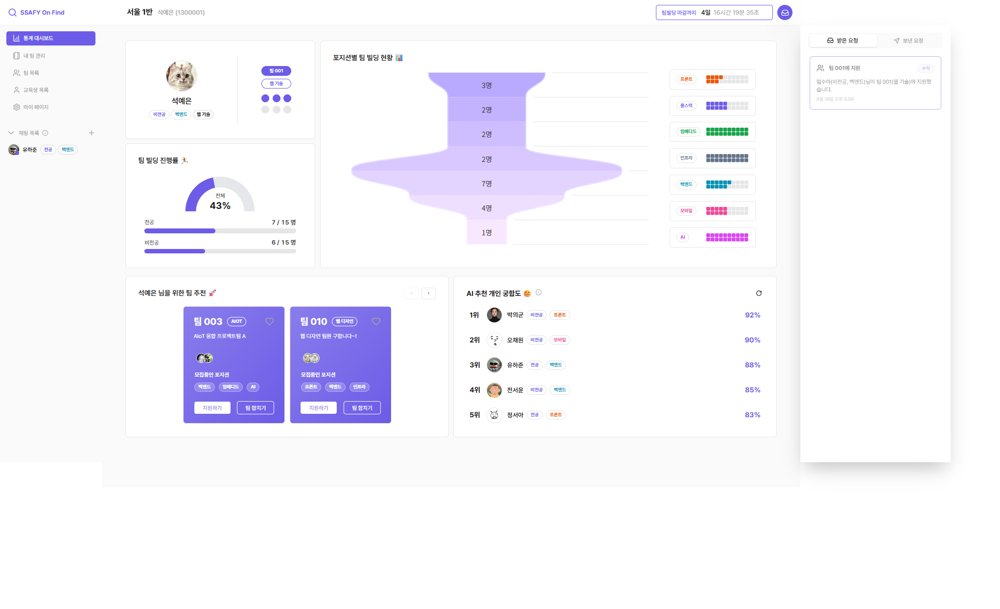
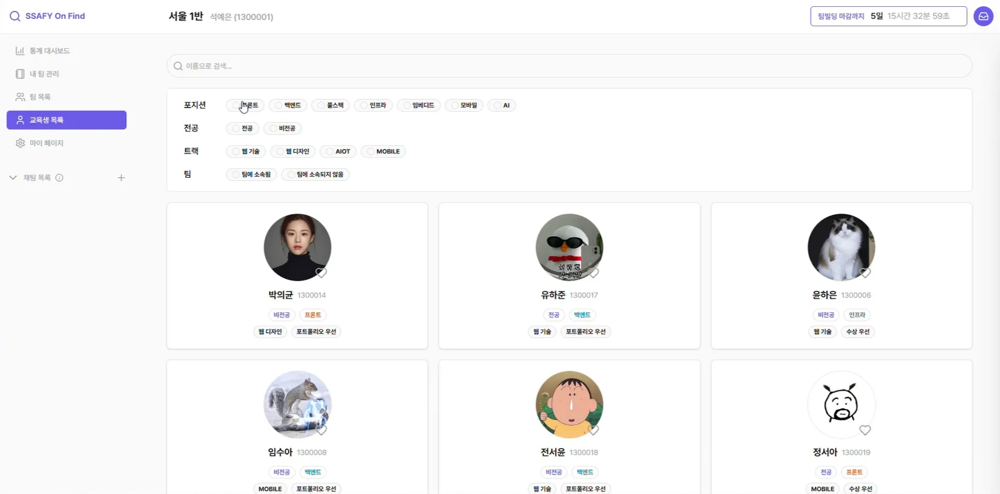
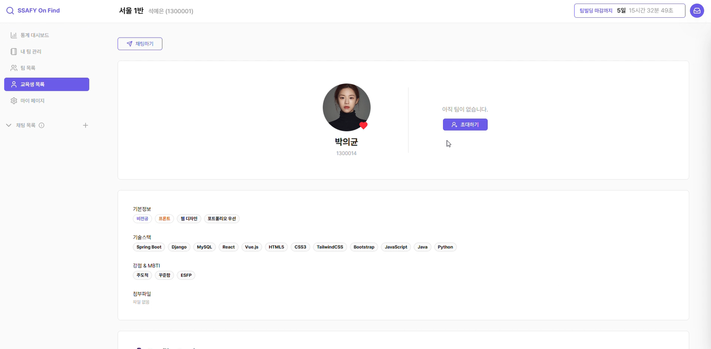
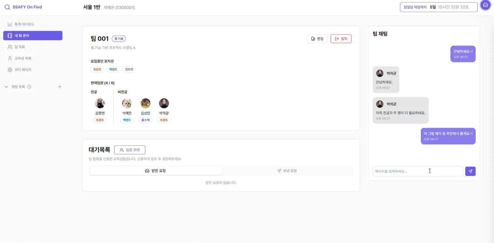
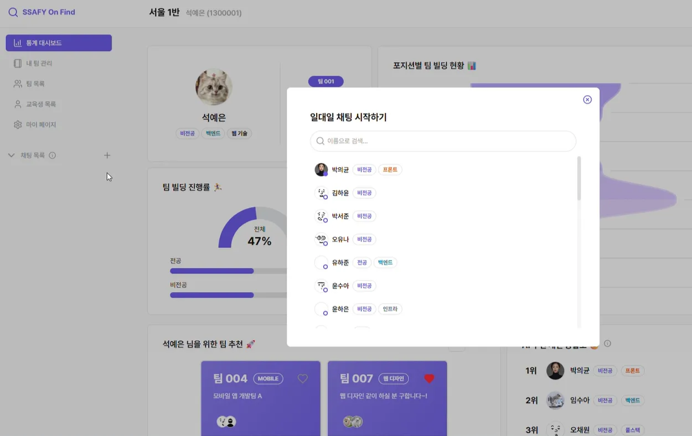
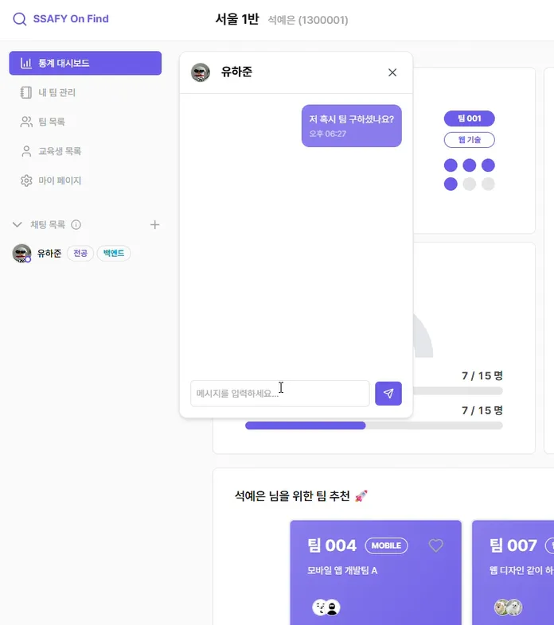
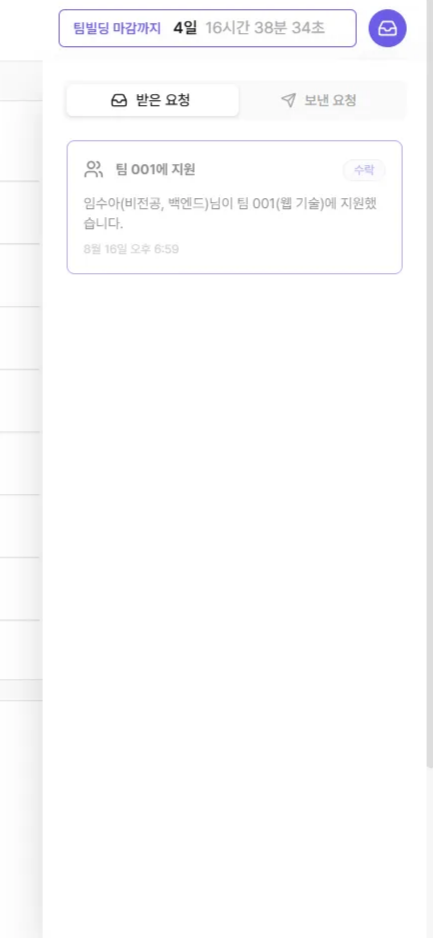
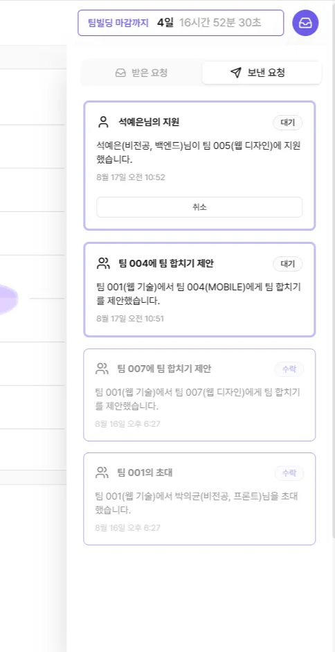

# 시연 시나리오

# 1. 대시보드 화면

# 2. 교육생 목록 화면

- 대시보드에서 사이드바에 `교육생 목록` 을 클릭하여 교육생 목록 페이지로 들어갑니다

- 필터 기능을 활용하여 `비전공, 프론트엔드` 를 필터링하여 `좋아요`버튼을 클릭합니다.

# 3. 교육생 상세 화면

- 다시 대시보드로 돌아간 다음에 우측하단에 있는 팀원추천에서 교육생을 한명 골라 교육생 상세 페이지로 들어갑니다.

- 초대하기 버튼을 눌러 팀으로 해당 교육생을 바로 초대합니다.

# 4. 내 팀 상세 화면

- 사이드바에 `내 팀 관리`를 클릭하여 내 팀 관리 페이지로 들어갑니다. 초대된 교육생과 팀채팅에서 채팅을 칩니다.

# 5. 일대일 채팅 화면

- 다시 대시보드로 돌아가 좌하단에 있는 팀 추천에서 팀을 골라 좋아요와 팀 합치기 버튼을 누릅니다.

## 5.1 일대일 채팅 시작하기

- 사이드바에서 채팅 목록 옆에 `+` 아이콘을 눌러 일대일 채팅을 시작할 교육생을 찾고 일대일 채팅을 시작합니다.

## 5.2 일대일 채팅 화면

# 6. 알림 화면

- 본인에게 온 모든 요청에 대해서 헤더 우상단에 알림함 버튼을 눌러 받은 요청과 보낸요청을 조회하고 상호작용할 수 있습니다.

  

