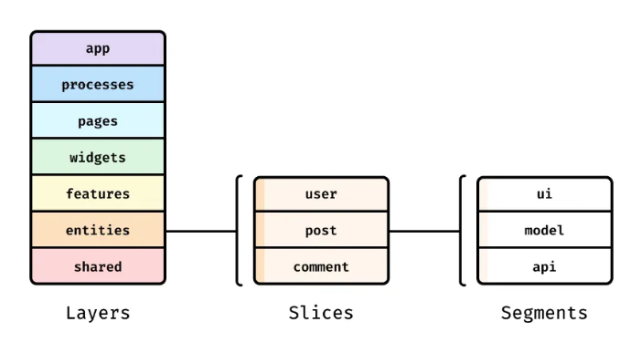

## `Feature-Sliced Design`
> 

- app : 프론트 앱 또는 모바일 앱의 전체적인 설정을 담당
    - Provider, Router, Client 같은 HOC가 slicer가 됨
- pages : 라우터에 따라 페이지 분리 → 브라우저 주소 단위의 컴포넌트
- shared : 공유하는 거 ex) hooks, utils, typings 등 → 유일하게 slice 없음
- entities : 기존의 components 에서 데이터 그 자체 (명사)
    - api segment에서 해당 데이터를 조회
- features : 기존의 components 에서 행위 (~뭐뭐하다 는 동사)
    - api segment에서 해당 행위를 요청
- widgets : 기존의 layout → features의 묶음 (어떻게 묶을지는 재사용 여부에 따라)

> 7계층에서 상위 계층은 하위 계층을 import 할 수 있지만 반대는 불가능!!!
> index.js에서 export 한 컴포넌트만 import 하자!!! → 캡슐화