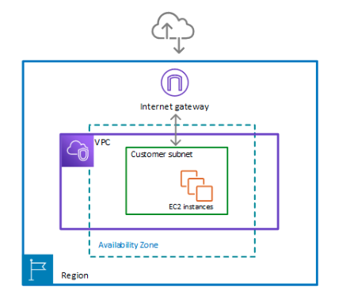
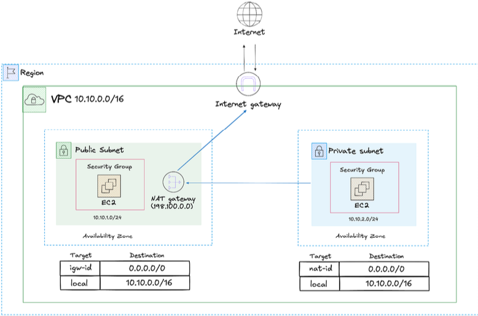
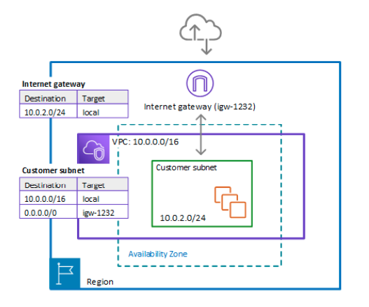
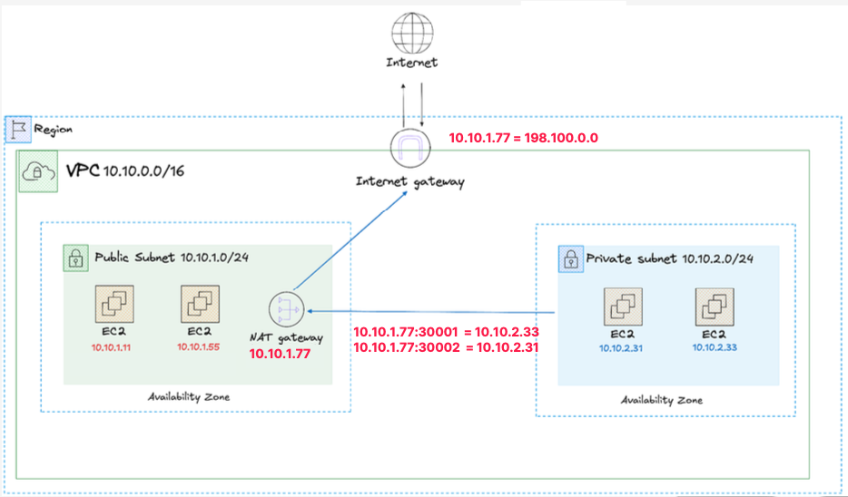
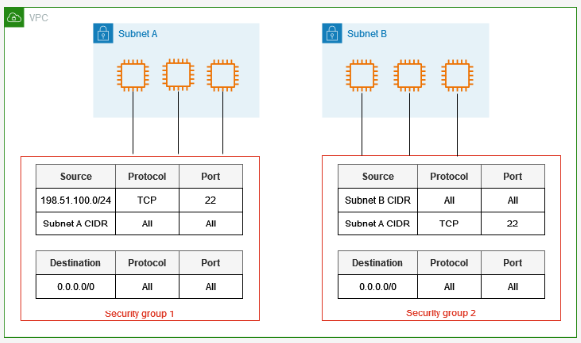
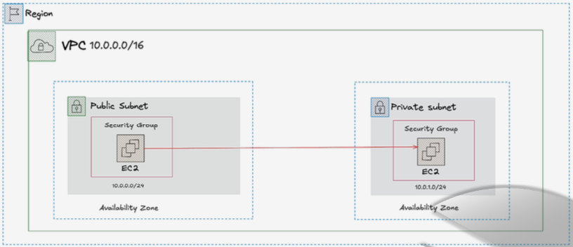
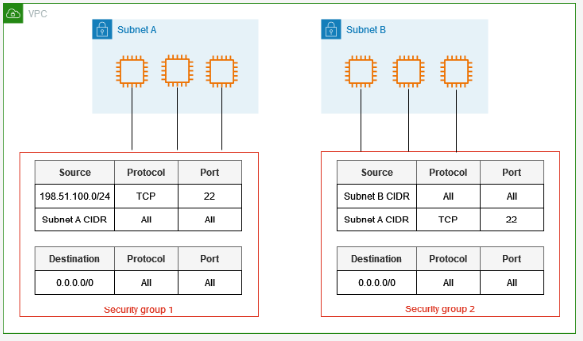
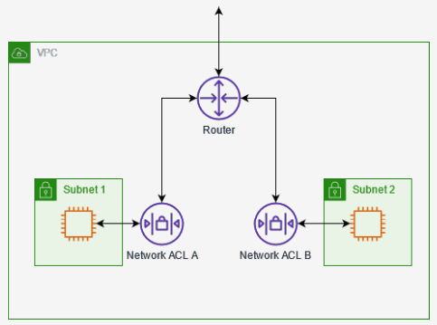

## ☑️ 1. VPC (Virtual Private Cloud) 개요 및 구성 요소

VPC는 AWS 클라우드 내에서 논리적으로 격리된 가상 네트워크 환경을 제공하는 서비스입니다. 사용자는 이 가상 네트워크의 IP 주소 범위를 직접 제어할 수 있습니다. VPC는 특정 Region에 종속됩니다.

### ✅ 1.1 VPC 구성요소

- **CIDR 블록**: VPC의 IP 범위를 정의합니다. (예: 10.10.0.0/16은 65,536개의 IP 주소 제공)
- **서브넷**: VPC를 작은 네트워크 단위로 분할한 것입니다. 퍼블릭/프라이빗 서브넷으로 구분됩니다.
- **인터넷 게이트웨이**: VPC에서 외부 인터넷으로 나가는 통로 역할을 합니다. Public Subnet에 연결되어 인터넷과의 통신을 가능하게 합니다.
- **NAT 게이트웨이**: 프라이빗 서브넷의 리소스가 외부 인터넷으로 나갈 수 있도록 IP 주소를 변환하지만, 외부에서는 프라이빗 서브넷으로 직접 접근할 수 없게 합니다.
- **라우트 테이블**: 네트워크 요소 간 트래픽 흐름을 관리하고 경로를 지정하는 규칙 모음입니다.

## ☑️ **2. VPC 서브넷 (Subnet)**

서브넷은 VPC 내에서 리소스를 배치하는 **기본 단위**이며, 어떻게 설계하느냐에 따라 서비스의 가용성과 리소스 배치가 결정됩니다.

### ✅ 2.1 서브넷 설계 시 고려사항

- **가용 영역 (Availability Zone, AZ) 분산:** 고가용성을 위해 여러 AZ에 서브넷을 분산 배치하는 것이 중요합니다. 특정 AZ에 장애가 발생해도 다른 AZ의 시스템은 유지될 수 있습니다.
- **CIDR 블록 관리**: 현재 리소스뿐만 아니라 **미래의 확장성**을 고려하여 충분한 IP 주소 공간을 할당하는 것이 중요합니다. 처음에 너무 작게 할당하면 나중에 서브넷을 확장해야 하는 번거로움이 생길 수 있습니다.
- **예약된 IP 주소:** AWS는 각 서브넷에서 아래의 5개 IP 주소를 예약하여 사용할 수 없습니다.
  - `x.x.x.0`: 네트워크 주소
  - `x.x.x.1`: AWS VPC 라우터용
  - `x.x.x.2`: AWS DNS 서버 IP
  - `x.x.x.3`: 예비용 IP
  - `x.x.x.255`: 브로드캐스트 IP

### ✅ 2.2 **퍼블릭 서브넷 vs. 프라이빗 서브넷**

두 서브넷의 가장 큰 차이는 **인터넷 게이트웨이(IGW) 연결 여부**입니다.

- **퍼블릭 서브넷 (Public Subnet)**
  - **인터넷 게이트웨이와 연결**되어 외부에서 직접 접근이 가능합니다.
  - 주로 웹 서버와 같이 외부 인터넷 연결이 필요한 리소스를 배치합니다.
- **프라이빗 서브넷 (Private Subnet)**
  - 외부로부터 **직접적인 연결이 차단**되어 있습니다.
  - NAT 게이트웨이를 통해서만 외부 인터넷 접속이 가능합니다.
  - 보안이 중요한 데이터베이스나 내부 API 서버 등을 배치합니다.

## ☑️ **3. 라우팅 테이블 (Routing Table)**

라우팅 테이블은 서브넷 내 트래픽의 흐름을 제어하는 규칙을 담고 있습니다.

- **작동 방식:** 각 서브넷은 하나의 라우팅 테이블과 연결되어 트래픽의 경로를 지정받습니다. 예를 들어, VPC 내부 IP 대역(`10.0.0.0/16`)으로 향하는 트래픽은 `local` 타겟으로, 그 외 모든 외부 IP 대역(`0.0.0.0/0`)으로 향하는 트래픽은 인터넷 게이트웨이(IGW)로 보내도록 규칙을 설정할 수 있습니다.
- **라우팅 규칙 우선순위:** **LPM (Longest Prefix Match)** 알고리즘에 따라 가장 구체적인(가장 좁은 범위의) 경로 규칙이 우선적으로 적용됩니다. 예를 들어,`10.0.1.0/24`가 `10.0.0.0/16`보다 더 좁은 범위이므로 우선 적용됩니다.

## ☑️ **4. NAT (Network Address Translation)**

내부 네트워크에서 사용하는 사설 IP(Private IP)를 외부망으로 나갈 때 공인 IP(Public IP)로 변환해주는 기술입니다.

### ✅ 4.1 필요성

- **보안 강화**: 내부 IP 주소를 외부에 노출시키지 않고, 하나의 공인 IP 뒤로 숨겨 보안을 강화합니다.
- **공인 IP 자원 절약**: 여러 서버가 하나의 공인 IP를 공유하여 인터넷과 통신할 수 있어 IP 자원을 효율적으로 사용합니다.

### ✅ 4.2 NAT의 두 가지 메커니즘

- **Static NAT**: 하나의 사설 IP를 **고정된 하나의 공인 IP**와 1:1로 매핑합니다. AWS의 **인터넷 게이트웨이(IGW)**가 이 방식으로 동작합니다.
- **PAT (Port Address Translation)**: 여러 사설 IP가 **하나의 공인 IP를 공유**하며, 포트 번호를 이용해 트래픽을 구분합니다. **NAT 게이트웨이**가 이 방식으로 동작하며, 다수의 프라이빗 인스턴스가 하나의 공인 IP로 외부와 통신할 수 있게 합니다.

## ☑️ 5. Elastic IP (탄력적 IP)

AWS에서 제공하는 **고정 공인 IP 주소**입니다.

- **사용 이유**: EC2 인스턴스 등은 재시작하면 공인 IP가 변경될 수 있으므로, 고정된 IP가 필요할 때 사용합니다. 특히 **NAT 게이트웨이에 할당하여 외부와 통신 시 고정된 IP를 사용하도록 합니다.**
- **과금 정책**: 할당된 Elastic IP가 리소스(EC2, NAT 게이트웨이 등)에 **연결되어 사용 중일 때는 무료**이지만, **연결되지 않은 유휴 상태일 때는 비용이 발생**합니다.

## ☑️ 6. Security Group과 NACL

VPC 환경의 보안을 책임지는 두 가지 핵심 방화벽 기능입니다.

### ✅ 6.1 Security Group (보안 그룹)

**인스턴스 수준**에서 동작하는 가상 방화벽입니다. 허용(Allow) 규칙만 설정할 수 있으며, 기본적으로 모든 트래픽을 차단합니다.

- **상태**: **Stateful(상태 저장)** 방식입니다. 인바운드 규칙에 의해 허용된 트래픽의 응답은 아웃바운드 규칙과 상관없이 자동으로 허용됩니다.
  

- **보안 그룹 체이닝**: IP 주소 대신 다른 **보안 그룹 ID를 소스(Source)로 지정**할 수 있습니다. 이를 통해 IP가 변경될 수 있는 인스턴스 간의 통신을 유연하고 안전하게 관리할 수 있습니다.

    

- Security Group : AWS에서 인스턴스 수준의 방화벽 역할을 하는 보안 규칙 집합입니다. EC2 인스턴스, RDS 데이터베이스 등 리소스에 직접 연결되며, 인바운드와 아웃바운드를 제어합니다. 주로 상태 기반(Stateful)으로 동작하며, 이는 들어온 요청에 대한 응답 트래픽은 자동으로 허용된다는 의미입니다.
  

- NACL(Network Access Control List) : 서브넷 수준에서 동작하는 방화벽입니다. NACL은 VPC 내에서 서브넷 전체의 인바운드와 아웃바운드 트래픽을 제어하며, 각 서브넷에 연결됩니다. NACL은 비상태 기반(StateLess)으로 동작하므로, 허용된 인바운드 트래픽에 대한 응답 아웃바운드 트래픽도 별도로 허용해야 합니다.

### ✅ 6.2 NACL (Network Access Control List)

**서브넷 수준**에서 동작하는 방화벽으로, 해당 서브넷의 모든 인스턴스에 일괄 적용됩니다. 허용(Allow) 및 거부(Deny) 규칙을 모두 지원합니다.

- **상태**: **Stateless(상태 비저장)** 방식입니다. 인바운드 트래픽에 대한**응답 트래픽도 아웃바운드 규칙에서 명시적으로 허용**해야만 통신이 가능합니다.
  

- **규칙 평가**: 규칙 번호(Rule #)가 있으며, 번호가 낮은 순서대로 규칙을 평가합니다. 매칭되는 규칙을 찾으면 즉시 적용하고 나머지 규칙은 평가하지 않습니다.
  
