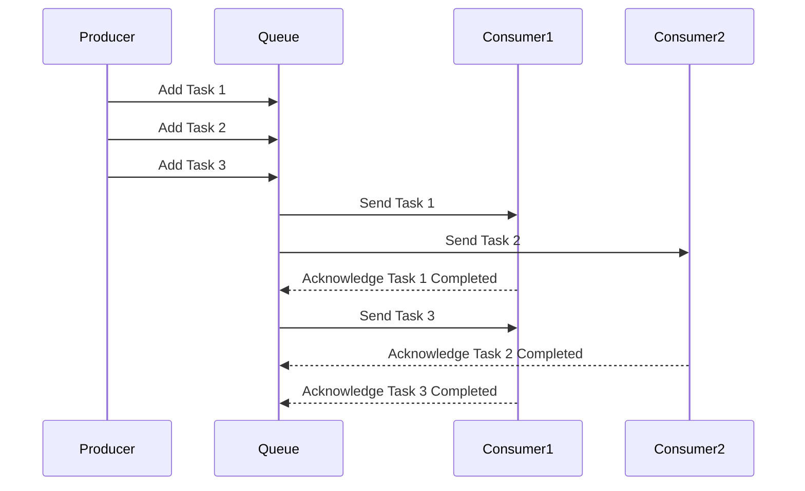
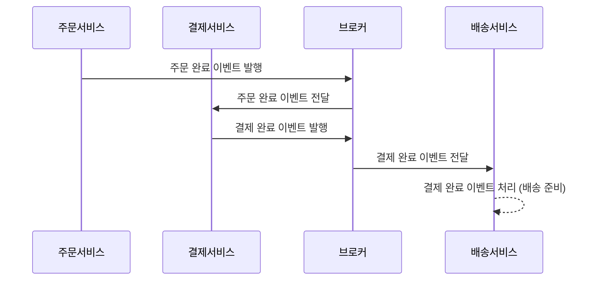

# 1. 비동기 메시징 시스템

- `프로듀서(Producer)`와 `컨슈머(Consumer)`가 독립적으로 동작하며, 서로 직접적으로 데이터를 주고받지 않고 `메시지 큐나 이벤트 버스`와 같은 `중간 메체`를 통해 통신하는 시스템
- 대규모 시스템에서는 많은 요청이 동시에 들어오고, 이러한 요청을 효율적으로 처리하기 위해서는 비동기 처리가 필수적
- `트래픽이 많은 환경` 에서 비동기 처리를 통해 시스템의 확장성과 안정성을 보장할 수 있음
- 이때 비동기 메시징 시스템 사용하여 아키텍처를 확장
- 주요 목적은 시스템간 느슨한 결합과 작업의 병렬 처리를 통해 효율성을 극대화

## 01. 비동기 메시징 시스템 이해

- 비동기 메시징 시스템은 시스템 간 또는 애플리케이션 내부의 여러 구성 요소 간 통신을 비동기적으로 처리하는 방식
- 작업이 비동기적으로 처리되기 때문에 각 구성 요소가 독립적으로 작업을 수행할 수 있어, 시스템의 확장성과 성능을 크게 향상 시킬 수 있음
- `독립성`, `확장성`, `성능 향상`
- `메시지 큐(Message Queue)`와 `메시지 브로커(Message Broker)`가 이러한 비동기 메시징 시스템의 핵심 요소

## 02. 메시지 큐와 메시지 브로커

- `메시지 큐(Message Queue)`: 메시지를 큐에 저장해 두고, 소비자가 준비되면 메시지를 비동기적으로 처리하는 역할
- `메시지 브로커(Message Broker)`: 이벤트 브로커는 발행-구독 패턴을 기반으로 여러 서비스가 이벤트를 구독하고, 특정 이벤트가 발생할 때 이 이벤트를 비동기적으로 구독자에게 전달

## 03. 메시징 시스템을 통한 비동기 처리

- `한 서비스가 작업을 완료하기 전`에 메시지를 큐에 넣고, `다른 서비스가 비동기적으로 이를 처리함으로써 시스템의 부하를 줄일 수 있음`
- 비동기 메시징 시스템의 간단한 적용

```java
@Service
public class MessageProducer {
	@Autowired
	private AmqpTemplate amqpTemplate;
	
	public void sendMessage(String message) {
		amqpTemplate.convertAndSend("exchangeName", "routingKey", message);
	}
}
```

# 2. 비동기 메시지 시스템 구현 방법

## 01. Message Queue

- 비동기 처리에서 자주 사용되는 작업 큐는 `요청을 처리하기 위해 순차적으로 저장된 작업을 관리`
- `Producer가 메시지를 큐에 넣고`, `Consumer`는 큐에서 메시지를 꺼내 비동기적으로 처리
- 큐는 작업을 병렬로 분산 처리하는 데 중요한 역할



## 02. Event-Driven Architecture

- 서비스 간 `느슨한 결합`과 `실시간 반응성`을 제공하는 또 다른 비동기 메시징 시스템
- 이벤트 기반 아키텍처는 `시스템 내에서 발생하는 상태변화를 이벤트로 처리하고, 각 서비스는 이 이벤트에 비동기적으로 반응` 하는 구조



## 03. 비동기 메시징 시스템의 확장성과 안정성 보장

### 확장성

- 메시지 큐나 이벤트 버스는 필요에 따라 소비자 또는 서비스 인스턴스를 동적으로 추가할 수 있어, 대규모 트래픽을 처리하기 위한 확장성을 보장

### 안정성

- 각 서비스가 독립적으로 동작할 수 있어 시스템의 한 부분에 문제가 생기더라도 전체 시스템이 중단되지 않고 작동

## 04. `이벤트 버스`(Event Bus)

- 이벤트 버스는 시스템 내에서 `발생하는 이벤트를 전달`하는 `비동기 메시징 시스템`
- 이벤트는 시스템 내의 상태 변화나 사용자 액션에 의해 발생하며, 이를 처리하기 위해 비동기적으로 여러 서비스 간에 전달
- `이벤트 버스의 동작원리`
    - Event Producer: 이벤트를 발생시키는 주체
    - Event Bus: 이벤트를 구독하고 있는 여러 서비스로 전달하는 역할
    - Event Consumer: 이벤트를 구독하고 있는 서비스

## 05. `메시지 큐`(Message Queue)

- 메시지 큐는 프로듀서가 생성한 메시지를 `큐`에 넣고, 이를 소비자가 `준비된 후에 처리`하는 구조
- 이 방식은 서비스 간 느슨한 결합을 가능하게 하고, 확장성을 높이는데 유용함
- `메시지 큐의 동작 원리`
    - Producer: 메시지를 생성하여 큐에 넣는 주체
    - Queue: 메시지가 일시적으로 저장되는 공간
    - Consumer: 큐에서 메시지를 가져가 처리하는 주체

## 06. `메시지 브로커`(Message Broker)

- 메시지 브로커는 메시지 큐나 이벤트 버스와 비슷한 개념이지만, 더 큰 범위에서 시스템 간 통신을 중개하는 역할
- 메시지 브로커는 서로 다른 애플리케이션이나 시스템 간에 비동기 메시지를 전달
- RabbitMQ, Kafka와 같은 도구가 여기에 해당
- `브로커의 주요 역할`
    - 메시지 저장: 메시지를 큐에 저장하여, 시스템이 메시지를 손실하지 않고 안정적으로 전달
    - 트래픽 분산: 브로커는 트래픽을 효율적으로 분산시켜 시스템에 과부하가 발생하지 않도록 도와줌
    - 서비스 간 중재: 서로 다른 시스템 간의 메시지를 중개하여, 각 시스템이 독립적으로 동작할 수 있도록 함

## 07. Message Queue vs Message Broker

| 메시지 큐 | 메시지 브로커 |
| --- | --- |
| 단순 메시지 저장소로써, 생산자와 소비자 간의 메시지 임시 저장을 담당 | 메시지의 흐름을 중개하고 라우팅을 담당 |
| FIFO 방식으로 메시지를 처리 | 다양한 전달 패턴을 지원 (예: Publish/Subscribe) |
| 단일 큐에 메시지를 저장하고 순차적으로 처리 | 메시지를 여러 수신자에게 동시 전달 가능 |
| 주로 일시적 저장과 처리 대기 역할 | 메시지의 전달 보장, 확장성, 변환 등을 관리 |
| RabbitMQ, Amazon SQS 같은 시스템에서 큐로 사용 | Kafka, RabbitMQ(브로커 역할 포함) 등에서 중개 역할 |