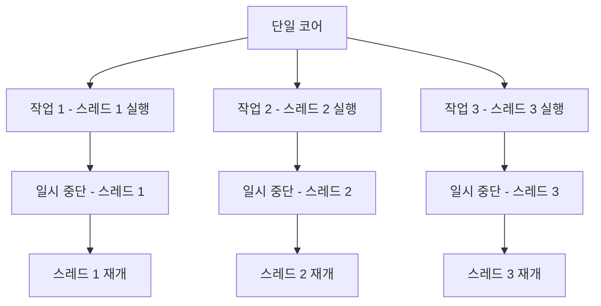
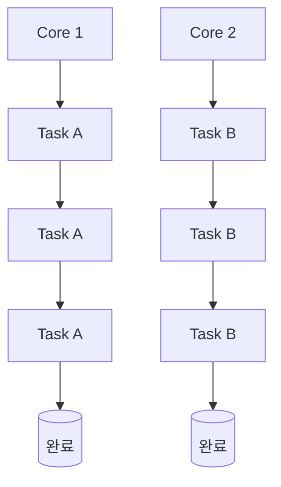
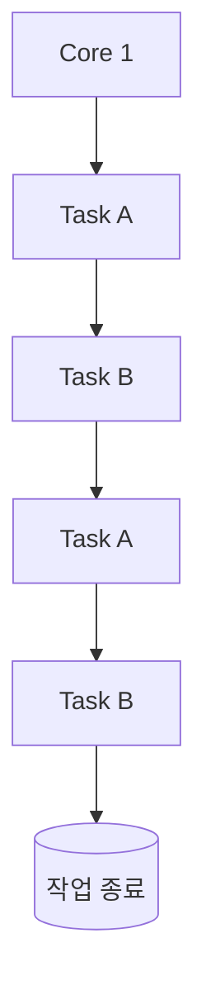
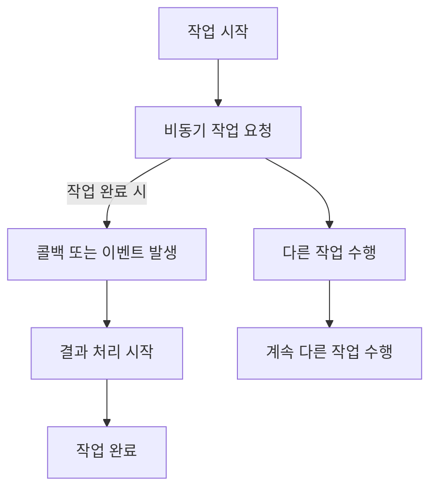
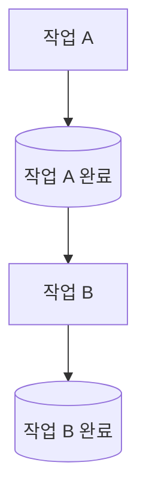
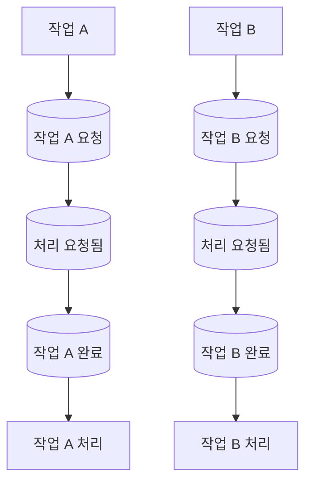

## 01. 동시성(Concurrency) 처리의 정의와 필요성

- 동시성은 여러 작업이 동시에 진행되는 것처럼 보이도록 설계된 시스템
- 실제로는 대부분의 경우 `단일 코어에서 여러 작업이 분할되어 교차로 처리`
- 사용자는 각 작업이 동시에 실행되는 것 처럼 느낌
- 멀티스레딩을 통해 각 작업을 독립적으로 실행 가능

### 01. 동시성 처리의 실제 활용: 웹 서버

- 웹 서버가 여러 클라이언트의 요청을 처리할 때, 각 요청에 대해 별도의 스레드를 생성하거나 작업을 교차적으로 처리하여 병렬성을 제공

```mermaid
**flowchart TD
    웹서버[웹 서버]
    A1[클라이언트 A 요청 처리 시작]
    A2[클라이언트 A 요청 대기 중]
    A3[클라이언트 A 요청 처리 재개]

    B1[클라이언트 B 요청 처리 시작]
    B2[클라이언트 B 요청 대기 중]
    B3[클라이언트 B 요청 처리 재개]

    웹서버 --> A1 --> A2 --> A3
    웹서버 --> B1 --> B2 --> B3**
```

## 02. 멀티스레딩(Multithreading): 동시성 구현 방법

- 멀티스레딩은 하나의 프로세스 내에서 여러 스레드를 사용하여 동시성 처리를 구현
- 각 스레드는 독립적으로 실행되며, 자원을 효율적으로 사용하여 응답 시간을 단축



## 03.병렬성(Parralleism)과 동시성(Concurency): 차이점과 활용방법

### 01. 병렬성(Parallelism)

- 병렬성은 물리적인 개념으로, 멀티 코어에서 여러 작업이 동시에 처리되는 것
- 여러 코어가 동시에 각각의 작업을 처리하기 때문에 실제로 작업이 동시에 수행


## 02. 동시성(Concurrency)

- 동시성은 논리적인 개념으로, 싱글 코어에서 여러 스레드를 번갈아가며 빠르게 실행하여 마치 동시에 여러작업이 수행되는 것 처럼 보이게 만드는 방식
- 이벤트 드리븐 시스템


## 04. 동시성 처리의 이점과 고려사항

### 장점

- 자원 효율성: 시스템 자원을 최대한 활용하여 작업을 빠르게 처리
- 응답성: 여러 작업을 동시에 처리하여 대기 시간을 줄이고, 특히 사용자 인터페이스(UI)에서 중요한 역할

### 단점

- 스레드 관리 문제: 여러 스레드를 생성하고 관리하는 것은 복잡할 수 있으며, 잘못 관리하면 교착 상태(Deadlock)나 경쟁 상태(Race Condition)같은 문제가 발생
- 동기화 문제: 스레드가 공유 자원을 동시에 접근할 때, 적절한 동기화 메커니즘이 없다면 데이터 손상이 발생

## 05. 비동기 처리(Asynchronous Processing)의 개념과 필요성

- 비동기 처리(Asynchronous Processing)는 `특정 작업이 완료될 때까지 기다리지 않고` 다른 작업을 계속 진행할 수 있는 처리 방식
- 이는 작업이 완료될 때까지 대기하지 않기 때문에, 시스템은 그동안 `CPU 자원을 다른 작업에 할당`할 수 있음
- 작업이 완료되면 `콜백(Call Back)이나 이벤트(Event)를 통해 결과`를 알리고, 그 결과에 대한 추가 작업이 수행


### 01. 비동기 처리의 실제 예시: 네트워크 요청과 UI

- 네트워크 요청 작업
- 파일 다운로드와 사용자 인터페이스

```java
CompletableFuture.supplyAsync(() -> {
	// 긴 시간이 걸리는 작업
	return "Result";
}).thenApply(result -> {
	// 작업 완료 후 처리
	System.out.println("Received: " + result);
	return result;
}).exceptionally(ex -> {
	// 오류 처리
	System.err.println("Error: " + ex.getMessage());
	return null;
});
```

## 05. 동기(Synchronous)처리 비동기(Asynchronous)처리의 차이점

### 동기(Synchronous)

- 동기 처리 방식은 작업이 순차적으로 실행됩니다. 하나의 작업이 완료되기 전까지 다른 작업을 시작하지 않으며, 작업 완료를 기다린 후 다음 작업을 수행


### 비동기(Asynchronous)

- 비동기 처리 방식은 작업을 요청한 후 기다리지 않고 다른 작업을 처리할 수 있습니다. 작업이 완료되면 그 결과를 나중에 처리할 수 있으며, 작업이 완료도리 때 콜백 또는 이벤트를 통해 알림


## 06. 비동기 처리의 이점과  한계

### 장점

- 병목현상 완화: 비동기 처리는 긴 시간이 소요되는 작업(ex. 네트워크 통신, 파일 읽기/쓰기)이 진행되는 동안 시스템 자원을 더 효율적으로 사용할 수 있게 함
- 성능 개선: 특히 네트워크 요청이나 파일 입출력 같은 작업에서 비동기 처리는 매우 유용함

### 단점

- 코드 복잡성: 비동기 처리를 사용하면 코드의 흐름이 복잡해질 수 있음.
- 오류 처리의 어려움: 비동기 작업 중 발생하는 오류(Exception)는 즉시 감지하기 어려움

| 특징 | 병렬성(Parallelism) | 동시성(Concurrency) | 비동기성(Asynchronous) |
| --- | --- | --- | --- |
| 주요 개념 | 물리적으로 동시에 실행됨 | 동시에 실행되는 것처럼 보이는 논리적 개념 | 이전 작업을 기다리지 않고 처리 |
| 코어 사용 | 멀티 코어 기반 | 싱글 코어 또는 멀티 코어에서도 가능 | 싱글 코어에서 비동기 작업 가능 |
| 작업 처리 | 다수의 작업을 물리적으로 동시에 처리 | 빠르게 교차하며 처리 | 작업을 위임하고 기다리지 않음 |
| 예시 | 멀티 코어 CPU에서 두 개의 작업 병렬 실행 | 싱글 코어에서 여러 스레드가 교차 처리 | 네트워크 요청 후 다른 작업 처리 |
| 장점 | 작업을 진정으로 동시에 처리하여 성능 극대화 | 빠른 컨텍스트 스위칭으로 효율적인 작업 처리 | 대기 없이 자원을 효율적으로 사용 |
| 단점 | 코어 수에 따라 병렬 작업 수가 제한됨 | 컨텍스트 스위칭 오버헤드가 발생할 수 있음 | 복잡한 오류 처리, 코드 가독성 감소 |