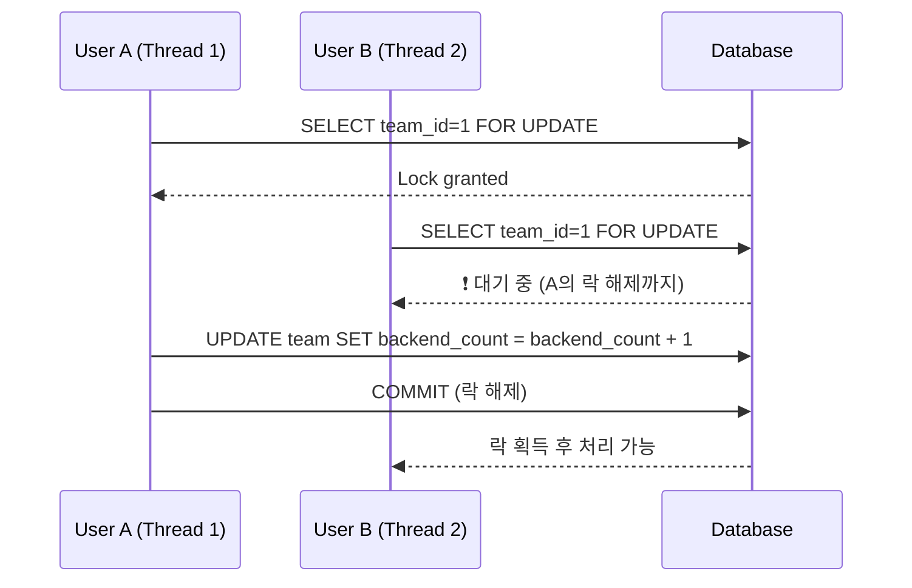
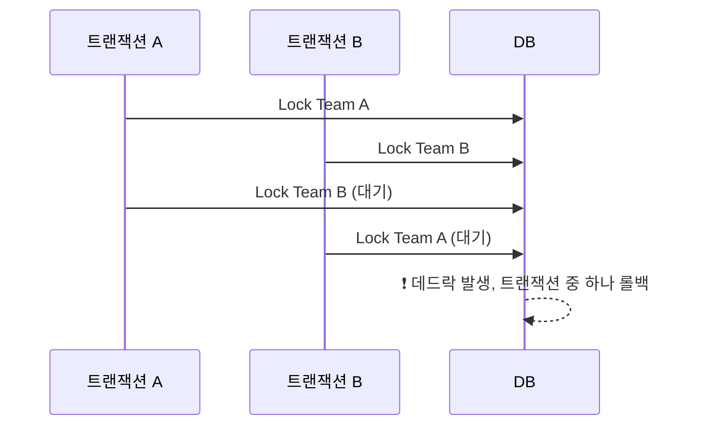

# 🔒 Pessimistic Lock (비관적 락) & Deadlock (교착 상태) 완전 정복

---

## 📌 개념 요약

| 용어 | 설명 |
| --- | --- |
| **Pessimistic Lock** | 데이터를 사용할 때 **다른 트랜잭션이 접근 못하도록** 선제적으로 락을 거는 방식 |
| **Deadlock** | 두 개 이상의 트랜잭션이 서로가 가진 자원을 기다리며 **무한 대기 상태**에 빠지는 현상 |

---

## 🔒 1. Pessimistic Lock (비관적 락)

### ✅ 개념 설명

- **"다른 누가 동시에 이 데이터를 수정할 수도 있으니, 먼저 락부터 걸자"**라는 관점
- 락을 거는 순간 **다른 트랜잭션은 해당 row에 접근할 수 없음 (차단됨)**
- 대부분의 RDBMS에서는 `SELECT ... FOR UPDATE`로 구현됨

---

### ✅ 동작 방식

1. 트랜잭션 시작
2. 대상 데이터를 `SELECT ... FOR UPDATE`로 조회 → **락 획득**
3. 데이터 변경
4. 커밋 또는 롤백 → 락 해제

---

### ✅ 특징

| 항목 | 설명 |
| --- | --- |
| 동시성 제어 | 아주 강력함 (정합성 보장) |
| 성능 | 락 유지 시간이 길어지면 병목 가능성 |
| 위험 요소 | **락 순서가 엇갈릴 경우 데드락 발생 가능성 존재** |
| 사용 시점 | 선착순 처리, 재고 차감, 팀 빌딩 등 **경쟁성 있는 자원 접근 시** 최적 |

---

### ✅ 예제 (Spring JPA)

```java
@Lock(LockModeType.PESSIMISTIC_WRITE)
@Query("SELECT t FROM Team t WHERE t.id = :id")
Team findByIdWithLock(@Param("id") Long id);

@Transactional
public void acceptInvite(Long teamId) {
    Team team = teamRepository.findByIdWithLock(teamId);

    if (team.getBackendCount() >= 3) {
        throw new IllegalStateException("자리 마감");
    }

    team.increaseBackendCount();
}

```



⛓ 2. Deadlock (데드락, 교착 상태)

✅ 개념 설명
•	두 개 이상의 트랜잭션이 서로가 필요한 자원을 서로 점유하고 있어 해제가 불가능한 상태
•	시스템이 자동으로 트랜잭션 중 하나를 강제로 롤백시켜야 해결됨

⸻

✅ 데드락 발생 조건 (4가지)

| 조건 | 설명 |
| --- | --- |
| 1. 상호 배제 (Mutual Exclusion) | 하나의 자원은 동시에 하나의 트랜잭션만 점유할 수 있다. |
| 2. 점유 대기 (Hold and Wait) | 트랜잭션이 자원을 점유한 상태로 다른 자원을 추가로 요청하며 대기한다. |
| 3. 비선점 (No Preemption) | 트랜잭션이 점유한 자원은 다른 트랜잭션이 강제로 빼앗을 수 없다. |
| 4. 순환 대기 (Circular Wait) | 트랜잭션 간에 서로 자원을 기다리는 원형 대기 상태가 존재한다. (A→B→C→A) |

✅ 이 네 가지 조건이 모두 충족되면 데드락 발생 가능성 있음

⸻

✅ 데드락 예시

- - 세션 A

```sql
START TRANSACTION;
SELECT * FROM team WHERE id = 1 FOR UPDATE;
-- 이후 팀 B에도 락 시도
```

- - 세션 B

```sql
START TRANSACTION;
SELECT * FROM team WHERE id = 2 FOR UPDATE;
-- 이후 팀 A에도 락 시도
```

→ A는 B의 락 기다리고, B는 A의 락 기다림 → 무한 대기 → 데드락

⸻

✅ Mermaid 시퀀스 다이어그램 (데드락 발생 구조)



⸻

✅ 데드락 해결 전략

| 전략 | 설명 |
| --- | --- |
| 🔁 락 획득 순서 고정 | 항상 A → B → C 순으로 락을 걸도록 코드 설계 |
| ⏳ 트랜잭션 최소화 | 트랜잭션 범위를 짧게 유지해서 락 보유 시간 줄이기 |
| 🔃 재시도 로직 구현 | Deadlock found... 예외 발생 시 자동 재시도 |
| ⚠ 복수 테이블 접근 제한 | 트랜잭션 안에서 여러 테이블을 동시에 락 걸지 않도록 주의 |

⸻

✅ Spring 기반 데드락 감지 예시

```java
@Transactional
public void process() {
    try {
        // 락 + 작업 처리
    } catch (DeadlockLoserDataAccessException e) {
        // 재시도 or 사용자 알림
    }
}

```