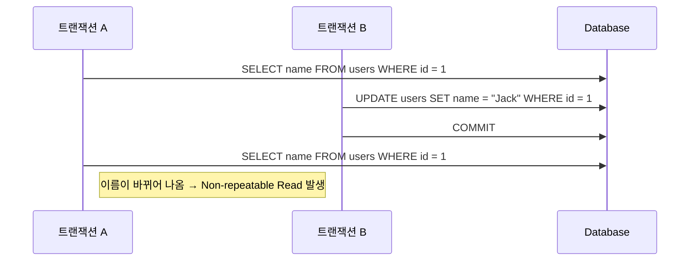

# 🔐 트랜잭션 고립 수준 (Transaction Isolation Level)

---

## 📌 트랜잭션이란?

> **트랜잭션(Transaction)**은 데이터베이스에서 하나의 논리적 작업 단위를 말하며,
항상 **ACID (원자성, 일관성, 고립성, 지속성)**를 보장해야 한다.
> 

---

## 🔒 Isolation (고립성) 이란?

> 고립성은 동시 실행되는 트랜잭션들이 서로 영향을 주지 않도록 격리시키는 정도를 의미한다.
이 고립 수준(Isolation Level)은 동시성 성능과 정합성 보장 사이의 트레이드오프를 결정한다.
> 

---

## 🚧 격리 수준 4단계 비교표

| 격리 수준 | 설명 | 허용되는 현상 | 정합성 | 성능 |
| --- | --- | --- | --- | --- |
| **READ UNCOMMITTED** | 커밋되지 않은 데이터도 읽을 수 있음 | ❗Dirty Read, ❗Non-repeatable Read, ❗Phantom Read | ❌ 매우 낮음 | 🔥 매우 빠름 |
| **READ COMMITTED** | 커밋된 데이터만 읽을 수 있음 | ❗Non-repeatable Read, ❗Phantom Read | ⚠ 보통 | 👍 빠름 |
| **REPEATABLE READ** (MySQL 기본) | 같은 트랜잭션 내에서는 같은 row 읽기 결과 유지 | ❗Phantom Read | ✅ 좋음 | 보통 |
| **SERIALIZABLE** | 모든 트랜잭션을 직렬화된 순서로 처리 | ❌ 없음 (모든 현상 방지) | ✅ 매우 높음 | ❗ 느림 (락 과다) |

---

## 🔍 허용/방지되는 현상

| 현상 | 설명 | 방지 수준 |
| --- | --- | --- |
| **Dirty Read** | A 트랜잭션이 커밋하지 않은 데이터를 B가 읽음 | READ COMMITTED 이상 |
| **Non-repeatable Read** | A가 읽은 데이터를 B가 바꾸고 A가 다시 읽으면 값이 달라짐 | REPEATABLE READ 이상 |
| **Phantom Read** | A가 조건에 맞는 row를 조회했는데, B가 insert하고 A가 다시 조회했을 때 결과가 달라짐 | SERIALIZABLE만 방지 가능 |

---

## 🧠 고립 수준 선택 가이드

| 상황 | 추천 격리 수준 |
| --- | --- |
| 단순 조회, 로그 기록 | READ UNCOMMITTED / READ COMMITTED |
| 게시판, 일반 CRUD | READ COMMITTED |
| 은행 송금, 팀 초대 수락 등 정합성 중요한 작업 | REPEATABLE READ or SERIALIZABLE |
| 아주 민감한 처리 (예: 선착순 티켓팅) | SERIALIZABLE + Pessimistic Lock |

---

## 💡 트랜잭션 격리 수준과 현상 예시

### 🧪 Dirty Read 예시 (READ UNCOMMITTED)

```sql
-- Tx A
BEGIN;
UPDATE users SET balance = 0 WHERE id = 1;

-- Tx B (동시에 실행)
SELECT balance FROM users WHERE id = 1;  -- ← 아직 커밋되지 않은 값 읽힘
```

---

## 🔄 Mermaid 시퀀스: Non-repeatable Read



---

## ⚙️ MySQL에서 트랜잭션 고립 수준 확인 및 설정

### ✅ 현재 고립 수준 확인

```sql
SELECT @@tx_isolation;         -- MySQL < 8
SELECT @@transaction_isolation; -- MySQL 8 이상
```

### ✅ 트랜잭션 시작 전에 고립 수준 설정

```sql
SET TRANSACTION ISOLATION LEVEL SERIALIZABLE;
START TRANSACTION;
```

---

## ✅ Spring에서 트랜잭션 고립 수준 설정

```java
@Transactional(isolation = Isolation.SERIALIZABLE)
public void acceptInvite(...) {
    // 정합성 가장 중요할 때 사용
}
```

---

## 📌 정리 요약

| 고립 수준 | 방지되는 현상 | 트레이드오프 |
| --- | --- | --- |
| READ UNCOMMITTED | 거의 없음 | 빠르지만 위험 |
| READ COMMITTED | Dirty Read 방지 | 기본 수준 |
| REPEATABLE READ | Non-repeatable 방지 | MySQL 기본 |
| SERIALIZABLE | 모두 방지 | 성능 저하 큼 |

---

## 📚 참고하면 좋은 키워드

- ACID (Atomicity, Consistency, Isolation, Durability)
- Pessimistic Lock / Optimistic Lock
- Deadlock (교착 상태)
- Transaction Retry / Rollback 전략