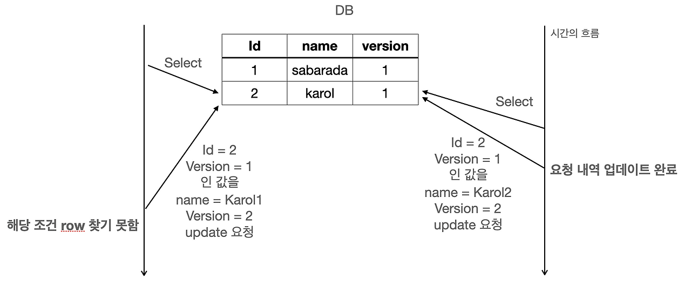
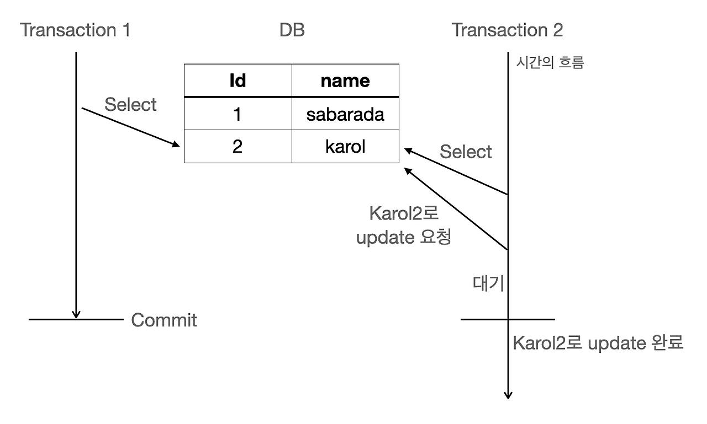

## 낙관적 락

- 충돌이 발생하지 않는다는 점을  가정하여 코드를 작성
- 여러 트랜잭션이 동시에 데이터에 접근할 수 있도록 허용한 후, 충돌이 일어날 때 예외 처리 코드를 작성하여 충돌 문제를 방지
- 애플리케이션 layer에서 처리
    
    
    

### ❓ 예외가 발생하는 경우

데이터를 읽은 후 데이터를 업데이트하는 동안 다른 트랜잭션에서 이미 데이터가 변경된 경우  
→ **값이 변경됨 == 버전이 변경됨**


---

### Stock Class

```java
public class Stock {
	@Id
	private Long productId;
	private Long stock;
	
	@Version    // 버전 관리용 필드
	private Long version;
]
```

###  SQL Query

```sql
Update Stock
SET stock = ?, version = ? #version++
WHERE
productId=? and version=?	
```

### JSP

```java
@Lock(LockModeType.OPTIMISTIC_FORCE_INCREMENT)
@Query("select s from Stock s where s.productId = :productId")
Optional<Stock> findAndForceIncrementVersionById(@Param("productId") Long productId);
```

### 재고 관리하는 코드

```java
try {
    stockOperation.run();
    return;
} catch (OptimisticLockingFailureException e) {   //낙관적 락 예외 발생
    handleRetry(attempt, e);
    Thread.sleep(delay);     //지수 백오프 전략
    delay *= 2;
    attempt++;
}

private void handleRetry(int attempt, Exception e) {
    log.warn("낙관적 락 실패 - 시도 {}/{}: {}", attempt + 1, maxAttempts, e.getMessage());
    if (attempt >= maxAttempts - 1) {
        log.error("최대 재시도 횟수 도달. 작업 실패.");
    }
}
```

### ⏳ 지수 백오프 전략 (Exponential Backoff)

- 요청이 실패했을 때, 다음 요청을 실행하는 시간 간격을 `2^n` 형태로 증가시킴


✅ **사용되는 상황**

- **낙관적 락 충돌**: 충돌 후 잠시 기다려서 트래픽 분산
- **네트워크 오류**: 일시적인 오류가 대부분이므로 시간을 두고 재시도 시 성공 확률 상승
- **서버 과부하**: 요청이 많은 경우 서버 회복 시간 확보


**장점**

- 서버 안전성 향상: 과도한 재시도 요청 방지
- 충돌 가능성 감소: 재시도 타이밍이 달라져 락 충돌 가능성 낮아짐

**단점**

- 대기 시간(delay) 증가로 사용자 응답성 저하

❗ 동일한 시간에 충돌한 트랜잭션이 다시 동일 시간에 실행될 경우 무한 delay 발생 가능

---


### 🔀 지수 백오프 전략 + Jitter

- 지수로 계산한 시간에 **랜덤한 Jitter** 시간 추가 → 충돌 가능성 더욱 감소


```java
actualDelay = baseDelay * 2^attempt;
jitter = Random(0, actualDelay / 2);
finalDelay = actualDelay + jitter;
```

- Spring JPA - interface + 실행

```java
@Retryable(maxAttempts = "5", backoff = @Backoff(delay = "1000", maxDelay = "30000", multiplier = "1.2", random = true)
)
public @interface RemoteRetryable {
    
    @AliasFor(annotation = Retryable.class, attribute = "recover")
    String recover() default "";

    @AliasFor(annotation = Retryable.class, attribute = "value")
    Class<? extends Throwable>[] value() default {};

    @AliasFor(annotation = Retryable.class, attribute = "include")
    Class<? extends Throwable>[] include() default {};

    @AliasFor(annotation = Retryable.class, attribute = "exclude")
    Class<? extends Throwable>[] exclude() default {};

    @AliasFor(annotation = Retryable.class, attribute = "label")
    String label() default "";
}
```

```java
@RemoteRetryable(recover = "fallbackMethod", include = {IOException.class})
public void callRemoteApi() {
    // API 호출 시 실패하면 최대 5회 재시도
}

public void fallbackMethod(IOException e) {
    log.error("API 실패 - 대체 로직 실행");
}
```

## 🔒 비관적 락 (Pessimistic Lock)

- 충돌이 **반드시 발생할 것**이라는 가정 하에 공유 자원에 **Lock**을 걸어 다른 트랜잭션이 접근하지 못하도록 제한하는 방식
- 트랜잭션이 완료되기 전까지 **다른 트랜잭션이 해당 자원에 접근 불가**


### 🔐 Lock 종류

- **Shared Lock (읽기 잠금)**: 다른 트랜잭션은 **읽기만 가능**, 쓰기는 불가
- **Exclusive Lock (쓰기 잠금)**: 다른 트랜잭션은 **읽기/쓰기 모두 불가**



---

    
###  Java 코드 예시

```java
interface UserRepository extends CrudRepository<User, Long> {

  @Lock(LockMode.PESSIMISTIC_READ)
  @QueryHints( {@QueryHint(name = "javax.persistence.lock.timeout", value = "10000")})
  List<User> findByLastname(String lastname);

	@Lock(LockModeType.PESSIMISTIC_WRITE)
	@Query("SELECT u FROM User u WHERE u.lastname = :lastname")
	List<User> findByLastnameForUpdate(@Param("lastname") String lastname);
}

```

- QueryHints : lock을 가지고 있어서 바로 예외 처리를 하는 것이 아니라 지정한 시간을 대기하고 예외 처리

### SQL 코드 예시

```sql
Select * from user u where u.lastname = lastname LOCK IN SHARE MODE  #8.0 버전 이하
Select * from user u where u.lastname = lastname FOR SHARE;     #8.0 버전 

Select * from user u where u.lastname = lastname FOR UPDATE;    #PESSIMISTIC_WRITE 
```

### ⚠️ 단점 - 데드락 (Deadlock)

- 서로 자원을 점유한 상태에서 상대방의 자원을 기다리는 상황이 발생하면 **무한 대기 상태**가 될 수 있음

#### ✅ Redis의 Sorted Set을 이용한 해결 방법

- 요청마다 **고유 ID**를 생성
- Redis의 Sorted Set에 다음과 같은 형식으로 저장  
  → `[score = currentTimeMillis(), value = 요청 ID]`
- Sorted Set에서 **가장 작은 score인지 확인**한 뒤 처리


###  상황에 따른 락 전략 선택

- **충돌이 자주 발생할 것으로 예상되는 경우** → ✅ **비관적 락**
- **동시성이 높은 환경에서 성능을 최적화해야 하는 경우** → ✅ **낙관적 락**
